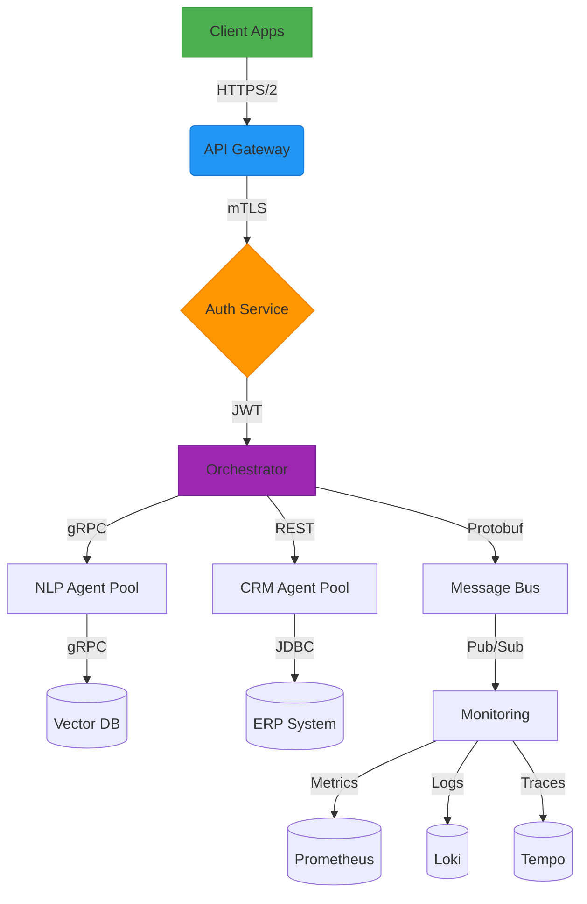
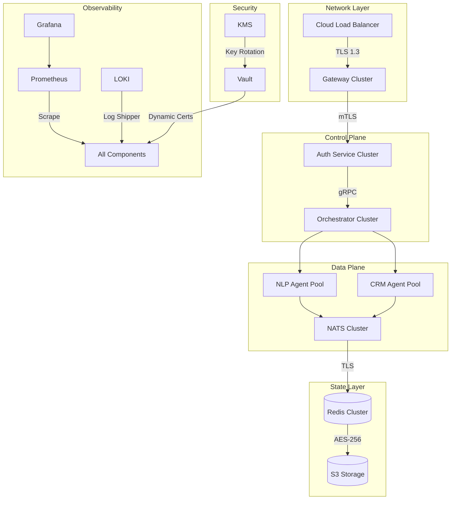

# BRIM Network - Enterprise-Grade Multi-Agent Framework

[](https://opensource.org/licenses/Apache-2.0)
[](https://www.python.org/)
[](https://github.com/brim-network/core/releases)
[](https://github.com/brim-network/core/actions)

**Next-Generation Enterprise AI Infrastructure for Secure, Scalable, and Governable Multi-Agent Systems**

[](https://twitter.com/BRIMAGENT)
[](https://twitter.com/NateHerman123)
[](https://www.linkedin.com/in/nathaniel-herman)


<a href="https://brimai.network/" target="_blank">View Official Website</a>


---

## 📌 Overview

BRIM Network is an enterprise-grade framework for building **secure**, **observable**, and **compliant** multi-agent AI systems. Designed for mission-critical deployments, it combines:

- 🔐 Zero-trust security architecture
- 🌐 Cross-industry interoperability
- 📊 Real-time governance controls
- 🤖 Hybrid human-AI collaboration

**Core Philosophy**: "Enterprise AI should be as manageable as traditional IT infrastructure"

---

## BRIM Architecture



## 🚀 Key Features

### **Enterprise-Ready Architecture**
| Feature                | Description                                                                 |
|------------------------|-----------------------------------------------------------------------------|
| **Multi-Protocol Gateway** | Unified API for gRPC/REST/WebSocket with automatic protocol translation     |
| **Crypto-Agile Security** | FIPS 140-3 compliant encryption with quantum-resistant algorithms           |
| **Federated Learning**     | Secure multi-party model training with differential privacy controls       |
| **Runtime Governance**     | Real-time SLA monitoring and policy enforcement engine                      |

### **Advanced Agent Capabilities**
```python
class BrimAgent:
    def __init__(self):
        self.security_context = ZeroTrustContext()  # FIPS-validated
        self.knowledge_graph = OntologyDrivenKG()   # Industry-specific
        self.audit_trail = ImmutableLedger()        # Blockchain-backed
```

## 🛠 Installation

### Prerequisites
```
# Core Dependencies
conda create -n brim python=3.10
conda activate brim
pip install "brim-core[enterprise]==1.0.0"

# GPU Acceleration (Optional)
pip install "brim-core[gpu]==1.0.0"
```

### Configuration
```
# config/brim.yaml
security:
  tls:
    cert: /etc/brim/certs/server.crt
    key: /etc/brim/certs/server.key

monitoring:
  prometheus:
    port: 9090
    metrics_path: /brim-metrics
```

## Production Deployment Topology


### Quick Start
```
# Start Local Cluster
brim-cluster start --nodes 3 --tls auto

# Deploy Sample Agent
brim-agent deploy examples/sentiment_analysis \
  --security-profile=hipaa \
  --resource-limit="cpu=2,mem=4gb"
```

## 🔍 Usage Examples

### 1. Secure Multi-Agent Collaboration
```
from brim_core import SecureOrchestrator

orchestrator = SecureOrchestrator(
    policy="gdpr_compliance_v3",
    audit_config={
        "retention_days": 365,
        "encryption": "aes-256-gcm"
    }
)

task = orchestrator.create_task(
    workflow="customer_service_escalation",
    participants=["nlp_agent", "crm_agent", "human_supervisor"],
    constraints={
        "max_latency": "500ms",
        "data_sovereignty": "eu-west-1"
    }
)
```

### 2. Federated Learning Workflow
```
brim fl-init --schema healthcare --participants hospital1,hospital2,hospital3 \
  --model resnet50 \
  --privacy "epsilon=3.0,delta=1e-5" \
  --aggregator secure_weighted_avg
```

## 🛡 Security & Compliance

### Certifications
- ISO 27001 Information Security Management
- SOC 2 Type II Compliance
- HIPAA/HITECH Ready

### Data Protection

| Control                | Implementation                                                                 |
|------------------------|-----------------------------------------------------------------------------|
| **Encryption** | AES-256-GCM (Data), ChaCha20-Poly1305 (Comms)     |
| **Access Control** | RBAC + ABAC with ReBAC policies           |
| **Audit Trail**     | Immutable WAL with cryptographic signatures       |


## 📊 Monitoring & Governance

### Key Metrics
```
# BRIM-specific Metrics
brim_agent_tasks_completed{status="success"} 5421
brim_model_accuracy{model="fraud_detection_v4"} 0.983
brim_api_latency_seconds{quantile="0.99"} 0.423
```

### SLA Management
```
{
  "service_levels": [
    {
      "name": "gold_tier",
      "latency": {"p99": "300ms"},
      "throughput": "1000 tps",
      "data_freshness": "5s"
    }
  ]
}
```

## 🌍 Deployment Options

### Cloud Providers
```
# AWS
brim-cloud deploy aws --profile enterprise-prod --region eu-west-1

# Azure
brim-cloud deploy azure --tier mission-critical --compliance hipaa
```

### On-Premises

```
brim-cluster init --topology ha \
  --security fips-140-3 \
  --storage ceph \
  --network calico
```

## 🤝 Contributing
### Development Setup
```
git clone https://github.com/brim-network/core.git
cd core
make install-dev
make gen-protobuf  # Generate gRPC interfaces
make security-scan  # Run SAST/DAST checks
```

### Code Standards
- Security: OWASP ASVS Level 2
- Testing: 90%+ coverage with mutation testing
- Docs: OpenAPI 3.1 + AsyncAPI 2.4 specifications


